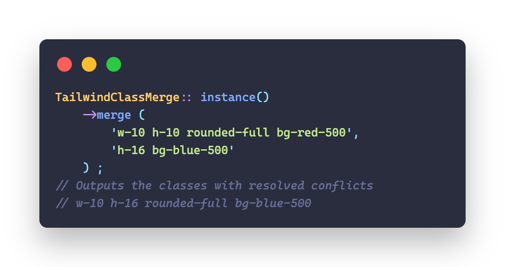

<p align="center">
    
    <p align="center">
        <a href="https://github.com/devanoxLtd/tailwind-class-merge-php/actions"></a>
        <a href="https://packagist.org/packages/devanox/tailwind-class-merge-php"></a>
        <a href="https://packagist.org/packages/devanox/tailwind-class-merge-php"></a>
        <a href="https://packagist.org/packages/devanox/tailwind-class-merge-php"></a>
    </p>
</p>

------

**TailwindClassMerge for PHP** allows you to merge multiple [Tailwind CSS](https://tailwindcss.com/) classes and automatically resolves conflicts between classes by removing classes conflicting with a class defined later.

A PHP port of [tailwind-merge](https://github.com/dcastil/tailwind-merge) by [dcastil](https://github.com/dcastil).
And clone and improve from [tailwind-merge-php](https://github.com/gehrisandro/tailwind-merge-php) by [gehrisandro](https:://github.com/gehrisandro).

Supports Tailwind v3.0 up to v3.3.

If you find this package helpful, please consider sponsoring the maintainer:
- Devanox Private Limited: **[github.com/sponsors/devanoxLtd](https://github.com/sponsors/devanoxLtd)**

> **Attention:** This package is still in early development.

> If you are using **Laravel**, you can use the [TailwindClassMerge for Laravel](https://github.com/devanoxLtd/tailwind-class-merge-laravel)

## Table of Contents
- [Get Started](#get-started)
- [Usage](#usage)
- [Configuration](#configuration)
  - [Custom Tailwind Config](#custom-tailwind-config)
- [Contributing](#contributing)

## Get Started

> **Requires [PHP 8.1+](https://php.net/releases/)**

First, install TailwindClassMerge via the [Composer](https://getcomposer.org/) package manager:

```bash
composer require devanox/tailwind-class-merge-php
```

Then, use the `TailwindClassMerge` class to merge your Tailwind CSS classes:

```php
use TailwindClassMerge\TailwindClassMerge;

$tw = TailwindClassMerge::instance();

$tw->merge('text-red-500', 'text-blue-500'); // 'text-blue-500'
```

You can adjust the configuration of `TailwindClassMerge` by using the factory to create a new instance:

```php
use TailwindClassMerge\TailwindClassMerge;

$instance = TailwindClassMerge::factory()
    ->withConfiguration([
        'prefix' => 'tw-',
    ])->make();

$instance->merge('tw-text-red-500', 'tw-text-blue-500'); // 'tw-text-blue-500'
```

For more information on how to configure `TailwindClassMerge`, see the [Configuration](#configuration) section.

## Usage

`TailwindClassMerge` is not only capable of resolving conflicts between basic Tailwind CSS classes, but also handles more complex scenarios:

```php
use TailwindClassMerge\TailwindClassMerge;

$tw = TailwindClassMerge::instance();

// conflicting classes
$tw->merge('block inline'); // inline
$tw->merge('pl-4 px-6'); // px-6

// non-conflicting classes
$tw->merge('text-xl text-black'); // text-xl text-black

// with breakpoints
$tw->merge('h-10 lg:h-12 lg:h-20'); // h-10 lg:h-20

// dark mode
$tw->merge('text-black dark:text-white dark:text-gray-700'); // text-black dark:text-gray-700

// with hover, focus and other states
$tw->merge('hover:block hover:inline'); // hover:inline

// with the important modifier
$tw->merge('!font-medium !font-bold'); // !font-bold

// arbitrary values
$tw->merge('z-10 z-[999]'); // z-[999]

// arbitrary variants
$tw->merge('[&>*]:underline [&>*]:line-through'); // [&>*]:line-through

// non tailwind classes
$tw->merge('non-tailwind-class block inline'); // non-tailwind-class inline
```

It's possible to pass the classes as a string, an array or a combination of both:

```php
$tw->merge('h-10 h-20'); // h-20
$tw->merge(['h-10', 'h-20']); // h-20
$tw->merge(['h-10', 'h-20'], 'h-30'); // h-30
$tw->merge(['h-10', 'h-20'], 'h-30', ['h-40']); // h-40
```

## Configuration

> **Note:** To do

### Custom Tailwind Config

> **Note:** To do

## Contributing

Thank you for considering contributing to `TailwindClassMerge for PHP`! The contribution guide can be found in the [CONTRIBUTING.md](CONTRIBUTING.md) file.

---

TailwindClassMerge for PHP is an open-sourced software licensed under the **[MIT license](https://opensource.org/licenses/MIT)**.
